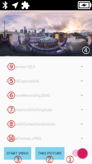

# THETA X Plug-in : Camera API Sample

Version: 1.3.0

This sample project shows how to implement a plug-in using Camera API for RICOH THETA X.
The program language is Kotlin, please checkout [java branch](https://github.com/ricohapi/theta-plugin-camera-api-sample-x/tree/java) to see Java code.

## Contents

* [Features](#features)
* [Requirement](#requirement)
* [How to Use](#how_to_use)
* [API Guide](#api_guide)
* [See Also](#see_also)
* [Terms of Service](#terms)
* [Trademark Information](#trademark)


<a name="features"></a>
## Features

* This sample project can capture image and video by using Camera API on RICOH THETA X.
* Captured image and video will be stored in DCIM/100_TEST folder, and the files will be named as PC*.JPG or MV*.MP4. If micro SD card is inserted, the files are stored in micro SD card automatically.
* Some Camera API Parameters can be set by UI.
* User Interface
    > * 
    > * ① Switch to start / stop camera preview
    > * ② Button to execute take picture
    > * ③ Button to execute start / stop video recording
    > * ④ Texture View to show preview picture
    > * ⑨ Spinner to choose RIC_SHOOTING_MODE for preview mode
    > * ⑤ Spinner to choose RIC_SHOOTING_MODE for image mode
    > * ⑥ Spinner to choose RIC_SHOOTING_MODE for video mode
    > * ⑦ Spinner to choose RIC_PROC_STITCHING
    > * ⑧ Spinner to choose RIC_PROC_ZENITH_CORRECTION
    > * Shutter Key : press to execute take picture ; same function as ②
    > * Mode Key : long press to exit plug-in


<a name="requirement"></a>
## Requirement

### Supported Device

* RICOH THETA X (Version 1.00.2, 1.10.1, 1.20.0, 1.30.0, 1.40.0, 1.41.0, 2.00.0)
* RICOH THETA V and Z1 are NOT supported.

### Development Environment

* Android Studio Chipmunk | 2021.2.1 Patch 2
    * Windows 10 Version 21H2
    * macOS Version 13.2.1 Ventura
* Gradle Plugin Version 4.2.2
* Gradle Version 6.7.1
* Android&trade; SDK (API Level 29)
* compileSdkVersion 29
* minSdkVersion 26
* targetSdkVersion 29
* [RICOH THETA Plug-in Library](https://github.com/ricohapi/theta-plugin-library) (Version 3.1.0) is being imported.


<a name="how_to_use"></a>
## How to Use

1. Import this sample project into Android&trade; Studio.
1. Verify that AndroidManifest.xml declears to support only RICOH THETA X.
    * app/src/main/AndroidManifest.xml

        ```xml
        <uses-feature android:name="com.theta360.receptor.x"  android:required="true" />
        <uses-feature android:name="com.theta360.receptor.z1" android:required="false" />
        <uses-feature android:name="com.theta360.receptor.v"  android:required="false" />
        ```

1. Verify that build.gradle set RICOH THETA Plug-in Library as dependencies.
    * app/build.gradle

        ```gradle
        dependencies {
            ...
            implementation 'com.theta360:pluginlibrary:3.1.0'
            ...
        }
        ```

    * build.gradle

        ```gradle
        allprojects {
        repositories {
            ...
            maven { url 'https://github.com/ricohapi/theta-plugin-library/raw/master/repository' }
            ...
        }
        ```

1. Connect RICOH THETA X to PC with USB cable.
1. Execute "Run" in Android&trade; Studio, then APK will be installed to RICOH THETA X automatically and you can debug it.


<a name="api_guide"></a>
## API Guide

### Import Classes

* RICOH THETA X supports 360 camera related features via theta360.hardware & theta360.media packages. Those classes can be imported with [RICOH THETA Plug-in Library](https://github.com/ricohapi/theta-plugin-library) (Version 3.0.0 or later).
* Basically com.theta360 APIs are designed to have same name & same interface as native Android APIs. But there are few different points between them, please note followings.

    ```java
    import theta360.hardware.Camera
    import theta360.media.CamcorderProfile
    import theta360.media.MediaRecorder
    ```

### How to open camera (theta360.hardware.Camera)

* Only following APIs support to open camera, which need to set Context as argument.

    ```java
    /**
     * @brief open camere resource
     * @param Context context
     * @param int cameraId : 0=BACK, 1=FRONT, 2=DOUBLE
     */
    public static Camera open(Context context)
    public static Camera open(Context context, int cameraId)
    ```

* When cameraId is set to Camera.CameraInfo.CAMERA_FACING_DOUBLE (0x0002), camera will run as dual lens mode. Use this mode if you want to capture 360 image or video. When cameraId is set to Camera.CameraInfo.CAMERA_FACING_BACK (0x0000) or CAMERA_FACING_FRONT (0x0001), camera will run as single lens mode.

    ```java
    public static final int Camera.CameraInfo.CAMERA_FACING_BACK = 0    // single lens mode
    public static final int Camera.CameraInfo.CAMERA_FACING_FRONT = 1   // single lens mode
    public static final int Camera.CameraInfo.CAMERA_FACING_DOUBLE = 2  // dual lens mode
    ```

### How to control the brightness of LCD panel and LEDs (theta360.hardware.Camera)

* After executing setBrightnessMode(1), the brightness will be controlled by camera AE automatically.

    ```java
    /**
     * @brief set the brightness controll mode of LCD panel and LED1/2
     * @param int mode : 0=manual, 1=auto (default)
     */
    public final void setBrightnessMode(int mode)
    ```

* After executing setBrightnessMode(0), the brightness can be controlled by following APIs. These APIs can be used regardless of openning camera resource.

    ```java
    /**
     * @brief set the brightness value of LCD panel
     * @param int brightness : 0 ~ 4095
     */
    public final void ctrlLcdBrightness(int brightness)

    /**
     * @brief get the brightness value of LCD panel
     */
    public int getLcdBrightness()

    /**
     * @brief set the brightness value of LED1/2
     * @param int ledId : 1=RED, 2=BLUE, 3=GREEN
     * @param int brightness : 0 ~ 255
     */
    public final void ctrlLedPowerBrightness(int ledId, int brightness)
    public final void ctrlLedStatusBrightness(int ledId, int brightness)

    /**
     * @brief get the brightness value of LED1/2
     * @param int ledId : 1=RED, 2=BLUE, 3=GREEN
     */
    public final int getLedPowerBrightness(int ledId)
    public final int getLedStatusBrightness(int ledId)
    ```

### How to use MediaRecorder class (theta360.media.MediaRecorder)

* setMediaRecorderContext is mandatory API to call, before video recording.

    ```java
    /**
     * @brief set context to MediaRecorder class
     * @param Context context
     */
    public void setMediaRecorderContext(Context context)
    ```

* There are several additional APIs compared to native Android APIs.

    ```java
    /**
     * @brief set gain to microphone
     * @param int micGain : 1=normal(default), 2=low
     */
    public void setMicGain(int micGain)

    /**
     * @brief set GOP configuration
     * @param float interval : 0.0f = I-frame only setting
     *                         1.0f = use 1 I-frame per 1.0 second
     * @remark 8K video can be encoded with I-frame only setting.
     */
     public void setVideoEncodingIFrameInterval(float interval)
    ```

* Tips : By using setProfile API with CamcoderProfile, MediaRecorder parameters can be set at once easily, like following.

    ```java
    setProfile(CamcorderProfile.get(CamcorderProfile.QUALITY_4K))
    ```

    | preset | HEX | audio<br>BitRate | audio<br>Channels | audio<br>Codec | audio<br>SampleRate | duration | fileFormat | quality | video<br>BitRate | video<br>Codec | video<br>FrameHeight | video<br>FrameWidth | video<br>FrameRate |
    | --- | :---: | :---: | :---: | :---: | :---: | :---: | :---: | :---: | :---: | :---: | :---: | :---: | :---: |
    | QUALITY_LOW  | 0x00 | 128_000 | 1 | 3(AAC) | 48_000 | 1500 | 2(MPEG_4) | 1 | 2_000_000  | 2(H264) | 960  | 1920 | 30 |
    | QUALITY_HIGH | 0x01 | 128_000 | 1 | 3(AAC) | 48_000 | 1500 | 2(MPEG_4) | 1 | 120_000_000 | 2(H264) | 2880 | 5760 | 30 |
    | QUALITY_2K   | 0x0C | 128_000 | 1 | 3(AAC) | 48_000 | 1500 | 2(MPEG_4) | 1 | 16_000_000 | 2(H264) | 960  | 1920 | 30 |
    | QUALITY_4K   | 0x0A | 128_000 | 1 | 3(AAC) | 48_000 | 1500 | 2(MPEG_4) | 1 | 54_000_000 | 2(H264) | 1920 | 3840 | 30 |
    | QUALITY_6K   | 0x0E | 128_000 | 1 | 3(AAC) | 48_000 | 1500 | 2(MPEG_4) | 1 | 64_000_000 | 2(H264) | 2880 | 5760 | 30 |
    | QUALITY_8K   | 0x0D | 128_000 | 1 | 3(AAC) | 48_000 | 1500 | 2(MPEG_4) | 1 | 64_000_000 | 2(H264) | 3840 | 7680 | 10 |

* Tips : You can disable showing liveview picture during video recording by setting following Camera.Parameter.

    ```java
    /**
     * @brief disable generating liveview picture during video recording, e.g. to reduce power.
     * @value 0 : enable (default)
     *        1 : disable
     */
    p.set(Camera.Parameters.VIDEO_PREVIEW_SWITCH, 0)
    ```

### Low power preview mode (available Version 1.20.0 or later)

* Preview will run at 15 fps as low power mode by setting preview frame rate to zero like following.

    ```java
    p.setPreviewFrameRate(0)
    ```

* Low power preview mode is available for following RIC_SHOOTING_MODE.

    | RIC_SHOOTING_MODE | witch | height |
    | --- | :---: | :---: |
    | RicPreview1024      | 1024 | 512  |
    | RicPreview1024:576  | 1024 | 576  |
    | RicPreview1920      | 1920 | 960  |
    | RicPreview1920:1080 | 1920 | 1080 |
    | RicPreview3840      | 3840 | 1920 |
    | RicPreview3840:2160 | 3840 | 2160 |
    | RicPreview5760      | 5760 | 2880 |


<a name="see_also"></a>
## See Also

* The latest information related to plug-in development is published on [api.ricoh](https://api.ricoh/docs/theta-plugin/).
* If you had a request or found a problem, please create new [issue](https://github.com/ricohapi/theta-plugin-camera-api-sample-x/issues).

---

<a name="terms"></a>
## Terms of Service

> You agree to comply with all applicable export and import laws and regulations applicable to the jurisdiction in which the Software was obtained and in which it is used. Without limiting the foregoing, in connection with use of the Software, you shall not export or re-export the Software  into any U.S. embargoed countries (currently including, but necessarily limited to, Crimea – Region of Ukraine, Cuba, Iran, North Korea, Sudan and Syria) or  to anyone on the U.S. Treasury Department’s list of Specially Designated Nationals or the U.S. Department of Commerce Denied Person’s List or Entity List.  By using the Software, you represent and warrant that you are not located in any such country or on any such list.  You also agree that you will not use the Software for any purposes prohibited by any applicable laws, including, without limitation, the development, design, manufacture or production of missiles, nuclear, chemical or biological weapons.

By using this sample project, you are agreeing to the above and the license terms, [LICENSE.txt](LICENSE.txt).

Copyright &copy; 2022 Ricoh Company, Ltd.


<a name="trademark"></a>
## Trademark Information

The names of products and services described in this document are trademarks or registered trademarks of each company.

* Android, Nexus, Google Chrome, Google Play, Google Play logo, Google Maps, Google+, Gmail, Google Drive, Google Cloud Print and YouTube are trademarks of Google Inc.
* Apple, Apple logo, Macintosh, Mac, Mac OS, OS X, AppleTalk, Apple TV, App Store, AirPrint, Bonjour, iPhone, iPad, iPad mini, iPad Air, iPod, iPod mini, iPod classic, iPod touch, iWork, Safari, the App Store logo, the AirPrint logo, Retina and iPad Pro are trademarks of Apple Inc., registered in the United States and other countries. The App Store is a service mark of Apple Inc.
* Bluetooth Low Energy and Bluetooth are trademarks or registered trademarks of US Bluetooth SIG, INC., in the United States and other countries.
* Microsoft, Windows, Windows Vista, Windows Live, Windows Media, Windows Server System, Windows Server, Excel, PowerPoint, Photosynth, SQL Server, Internet Explorer, Azure, Active Directory, OneDrive, Outlook, Wingdings, Hyper-V, Visual Basic, Visual C ++, Surface, SharePoint Server, Microsoft Edge, Active Directory, BitLocker, .NET Framework and Skype are registered trademarks or trademarks of Microsoft Corporation in the United States and other countries. The name of Skype, the trademarks and logos associated with it, and the "S" logo are trademarks of Skype or its affiliates.
* Wi-Fi™, Wi-Fi Certified Miracast, Wi-Fi Certified logo, Wi-Fi Direct, Wi-Fi Protected Setup, WPA, WPA 2 and Miracast are trademarks of the Wi-Fi Alliance.
* The official name of Windows is Microsoft Windows Operating System.
* All other trademarks belong to their respective owners.
